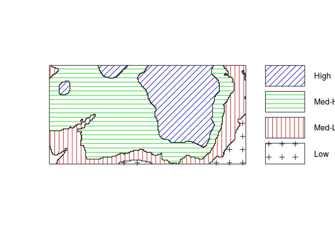
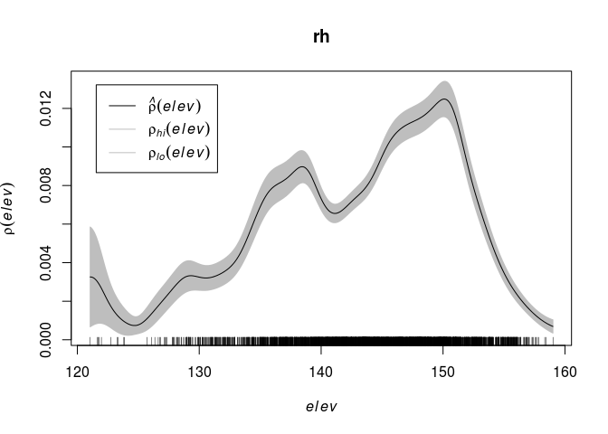
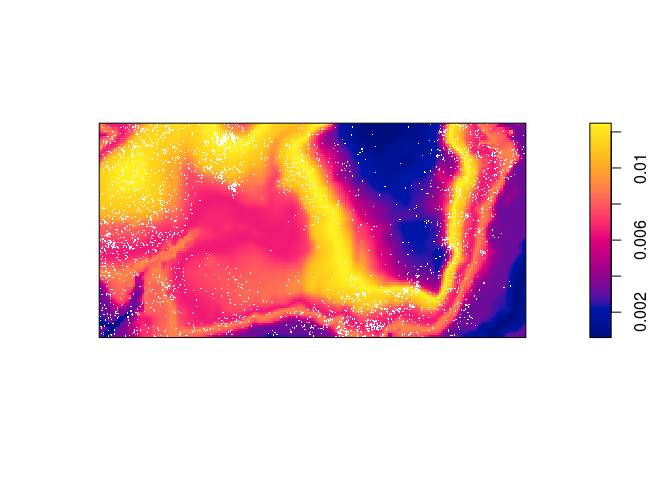
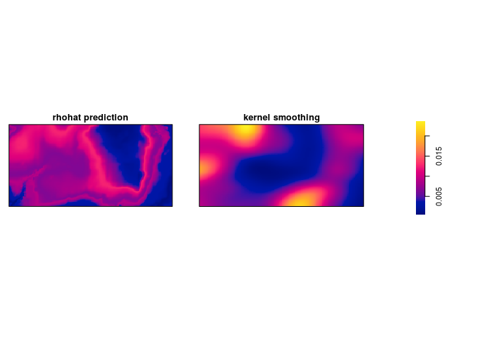
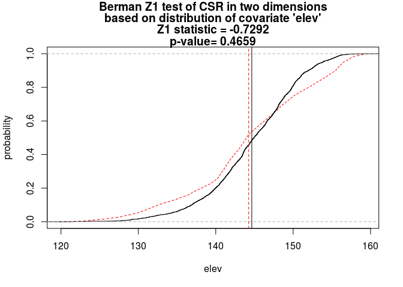
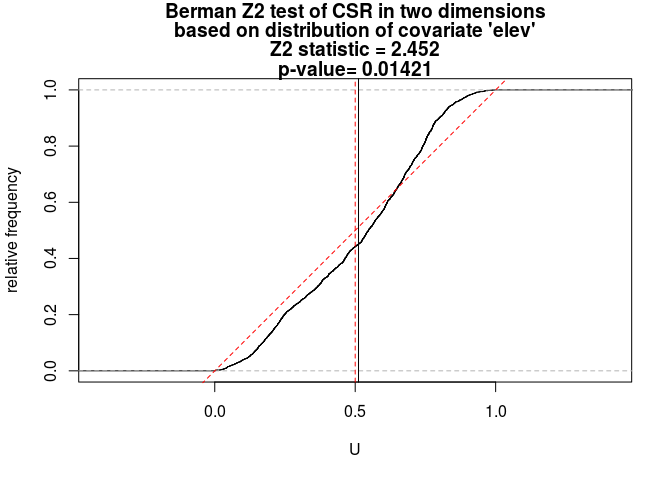

Lab 3: Intensity dependent on covariate
================

This session covers tools for investigating intensity depending on a covariate.
The lecturer's R script is [available here](https://raw.githubusercontent.com/spatstat/testWorkshop/master/Scripts/script03.R) (right click and save).

``` r
library(spatstat)
```

### Exercise 1

The `bei` dataset gives the locations of trees in a survey area with additional covariate information in a list `bei.extra`.

1.  Assign the elevation covariate to a variable `elev` by typing

    ``` r
    elev <- bei.extra$elev
    ```

    OK, lets do that:

    ``` r
    elev <- bei.extra$elev
    ```

2.  Plot the trees on top of an image of the elevation covariate.

    ``` r
    plot(elev, main = "")
    plot(bei, add = TRUE, cex = 0.3, pch = 16, cols = "white")
    ```

    

3.  Cut the study region into 4 areas according to the value of the terrain elevation, and make a texture plot of the result.

    ``` r
    Z <- cut(elev, 4, labels=c("Low", "Med-Low", "Med-High", "High"))
    textureplot(Z, main = "")
    ```

    

4.  Convert the image from above to a tesselation, count the number of points in each region using `quadratcount`, and plot the quadrat counts.

    ``` r
    Y <- tess(image = Z)
    qc <- quadratcount(bei, tess = Y)
    ```

5.  Estimate the intensity in each of the four regions.

    ``` r
    intensity(qc)
    ```

        ## tile
        ##         Low     Med-Low    Med-High        High 
        ## 0.002259007 0.006372523 0.008562862 0.005843516

### Exercise 2

Assume that the intensity of trees is a function *λ*(*u*)=*ρ*(*e*(*u*)) where *e*(*u*) is the terrain elevation at location u.

1.  Compute a nonparametric estimate of the function *ρ* and plot it by

    ``` r
    rh <- rhohat(bei, elev)
    plot(rh)
    ```

    Repeating the R code:

    ``` r
    rh <- rhohat(bei, elev)
    plot(rh)
    ```

    

2.  Compute the predicted intensity based on this estimate of *ρ*.

    ``` r
    prh <- predict(rh)
    plot(prh, main = "")
    plot(bei, add = TRUE, cols = "white", cex = .2, pch = 16)
    ```

    

3.  Compute a non-parametric estimate by kernel smoothing and compare with the predicted intensity above.

    The kernel density estimate of the points is computed and plotted with the following code:

    ``` r
    dbei <- density(bei, sigma = bw.scott)
    plot(dbei, main = "")
    plot(bei, add = TRUE, cols = "white", cex = .2, pch = 16)
    ```

    

    Which seems to be quite different form the predicted intentisty.

4.  Bonus info: To plot the two intensity estimates next to each other you collect the estimates as a spatial object list (`solist`) and plot the result (the estimates are called `pred` and `ker` below):

    ``` r
    l <- solist(pred, ker)
    plot(l, equal.ribbon = TRUE, main = "", 
         main.panel = c("rhohat prediction", "kernel smoothing"))
    ```

    ``` r
    l <- solist(prh, dbei)
    plot(l, equal.ribbon = TRUE, main = "",
         main.panel = c("rhohat prediction", "kernel smoothing"))
    ```

    

### Exercise 3

1.  Continuing with the dataset `bei` conduct both Berman's Z1 and Z2 tests for dependence on `elev`, and plot the results.

    The tests are done straightforwardly with `berman.test`:

    ``` r
    Z1 <- berman.test(bei, elev)
    print(Z1)
    ```

        ## 
        ##  Berman Z1 test of CSR in two dimensions
        ## 
        ## data:  covariate 'elev' evaluated at points of 'bei'
        ## Z1 = -0.72924, p-value = 0.4659
        ## alternative hypothesis: two-sided

    ``` r
    plot(Z1)
    ```

    

    ``` r
    Z2 <- berman.test(bei, elev, which = "Z2")
    print(Z2)
    ```

        ## 
        ##  Berman Z2 test of CSR in two dimensions
        ## 
        ## data:  covariate 'elev' evaluated at points of 'bei' 
        ##   and transformed to uniform distribution under CSR
        ## Z2 = 2.4515, p-value = 0.01423
        ## alternative hypothesis: two-sided

    ``` r
    plot(Z2)
    ```

    
